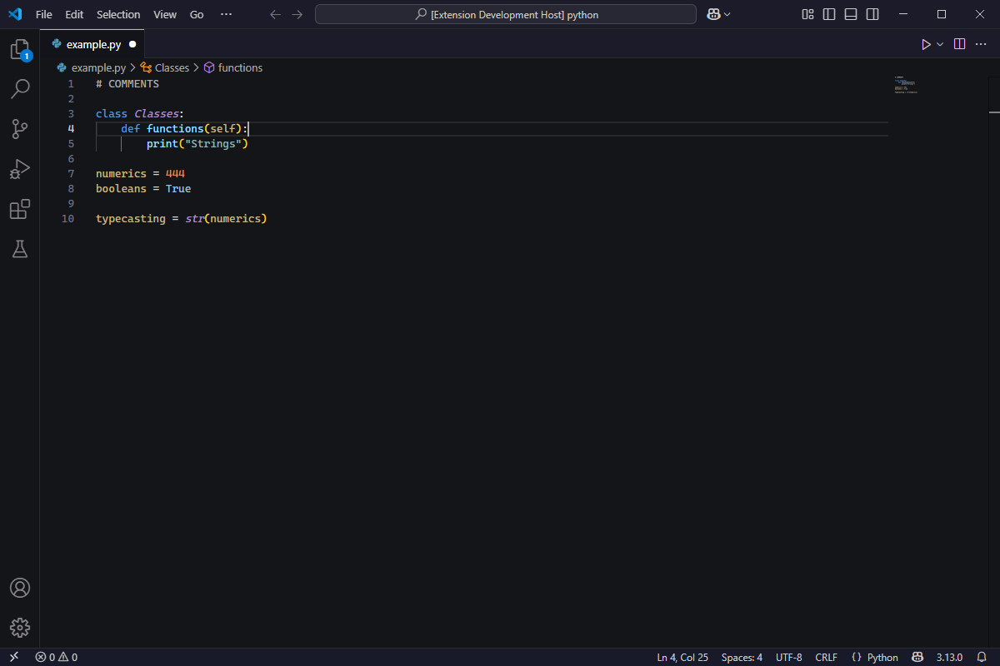

<h1 align=center>

 
Clarity Code
</h1>

<h2 align = center>
A VS Code theme to make syntax highlighting make sense
 
Different code elements are colored naturally for optimal readability.
</h2>

<h1 align = center>

</h1>